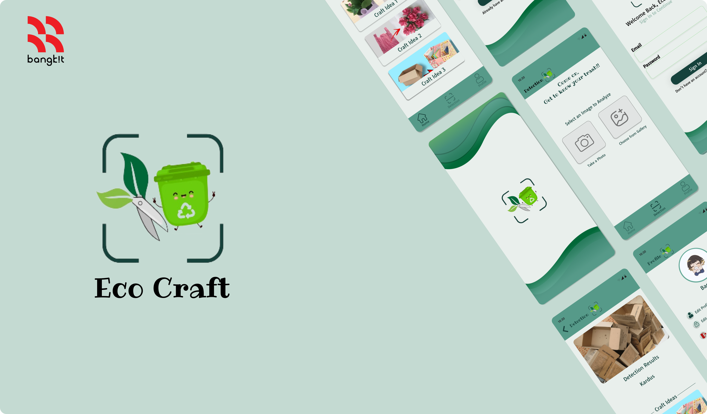

# EcoCraft: Turn Trash into Treasure

**EcoCraft** is an application designed to repurpose recyclable waste into practical crafts creatively. Users can discover a wide range of craft ideas by uploading photos of recyclable materials, which are then transformed into beautiful and functional crafts. 

This idea comes from our concern that people are unaware of the environmental damage caused by littering, and few recognize that waste can be creatively repurposed rather than discarded.
## Features ✨

- **Waste Type Detection**: Automatically identifies recyclable waste types using advanced detection algorithms.
- **Craft Recommendations**: Provides personalized craft suggestions based on the detected waste materials.
- **Craft Ideas Library**: Access a curated list of creative craft ideas to inspire upcycling projects.
- **Detection History**: Keeps a record of previously detected waste types and associated recommendations.
- **Craft Ideas Posting**: Share your creative upcycling projects with the community.
- **User Authentication**: Secure login and registration for personalized user experiences.
- **Profile Customization**: Personalize your profile to reflect your unique crafting identity.

## Authors 👥

Bangkit Team: C242-PS456

| ID |  Name  | Learning Path |
|:-----|:--------|------|
| M008B4KY3362 | Nicolas Dwi Hardjoleksono | Machine Learning |
| M008B4KY2871 | Muhammad Haikal Syafi Alawiy | Machine Learning |
| M008B4KY0271 | Aizar Hafizh Soejadi | Machine Learning |
| C008B4KY0761 | Azhar Bagaskara | Cloud Computing |
| C008B4KY1669 | Hafizh Al Muzakar | Cloud Computing |
| A226B4KX0165 | Afrina Layanti Pasaribu | Mobile Development |
| A225B4KY2734 | Muhammad Arda’ Zainurrohim | Mobile Development |

## Tech Stack 🛠️

**Machine Learning**: TensorFlow, OpenCV.

**Cloud Computing**: TypeScript, Node.js, Express.js, Flask, Firestore, Cloud Storage, Cloud Run, Cloud Build. 

**Mobile Development**: Figma, Kotlin, Retrofit.
